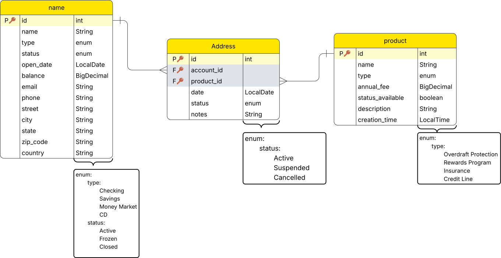

# Account & Financial Product Manager
Manager application to control and administer bank accounts and financial products. See more details in unpublished requirements document.

## Data Diagram
https://lucid.app/lucidchart/14d9c12c-658c-4409-9b85-e1a7d84b64f8/view

## Functions
### Account Management
Add New Account

View Account Details

Edit Account Information

Delete Account

### Financial Product Management
Add New Product

Edit Product Information

Delete Product

View Product Catalog

### Enrollment Management
Enroll Account in Product

Edit an Enrollment

Remove Product from Account

View Products by Account

View Accounts by Product

### User Interface (UI) & User Experience (UX)
Dashboard Overview

Responsive Design

Error Handling

###  Edge Cases
Duplicate Enrollments

Enrollment on Inactive Account

## Tech Stack
•	Java with Spring Boot

•	JUnit for backend unit testing

•	PostgreSQL

•	HTML/CSS/JS or Angular

•	Bootstrap, Tailwind, or PrimeNG for styling

•	GitHub
